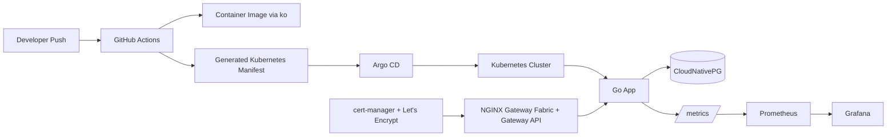

# DevOps Project: Go App + PostgreSQL + Observability + Kubernetes + GitOps

This repository is a compact but complete DevOps showcase built around a small Go application that stores goals in PostgreSQL and exposes Prometheus metrics. The interesting part is not the app itself; it is the delivery pipeline around it: image builds with `ko`, immutable deployment manifests, Kubernetes Gateway API ingress, TLS via cert-manager, autoscaling, ServiceMonitor-based scraping, Argo CD routing, and a reproducible local stack for development.

[Video walkthrough](https://www.youtube.com/watch?v=kCWAwXFnYic)

## Why this project is strong from a DevOps perspective

- A real application with state, not just a static website
- Container build pipeline for consistent packaging
- GitHub Actions for CI and image publishing
- Immutable image tagging with commit SHA
- Kubernetes deployment with health probes and resource limits
- Horizontal Pod Autoscaler for runtime elasticity
- CloudNativePG for in-cluster PostgreSQL
- Prometheus and Grafana for metrics and dashboards
- ServiceMonitor integration for operator-friendly scraping
- Gateway API + NGINX Gateway Fabric for modern traffic management
- cert-manager with Let's Encrypt for TLS automation
- Argo CD exposure for GitOps-style operations

## Architecture



## Repository layout

```text
.
|-- .github/workflows/
|   |-- build_push.yml      # Build and publish image, regenerate deploy manifest
|   `-- ci.yml              # Test + container/security scan
|-- deploy/deploy.yaml      # Generated deployment manifest
|-- tmpl/deploy.j2          # Source template for deployment manifest
|-- Dockerfile              # Local and CI container build
|-- docker-compose.yml      # Local app + postgres + prometheus + grafana stack
|-- hpa.yaml                # Horizontal Pod Autoscaler
|-- servicemonitor.yaml     # Prometheus Operator scrape config
|-- pg_cluster.yaml         # CloudNativePG cluster
|-- cluster_issuer.yaml     # cert-manager ClusterIssuer
|-- argo-gateway.yaml       # Shared Gateway definition
|-- route-argo.yaml         # Argo CD HTTPRoute
|-- prometheus.yml          # Local Prometheus config
|-- load.js                 # k6 load-test script
|-- ops/postgres/init.sql   # Local database bootstrap
|-- kodata/index.html       # UI template bundled into the app
`-- main.go                 # Go application
```

## What the application does

- Serves a small goals UI on `/`
- Inserts and deletes rows in PostgreSQL
- Exposes `/health` for Kubernetes probes
- Exposes `/metrics` for Prometheus
- Tracks custom counters for goal creation, deletion, and request volume

## Quick start: local stack in one command

### Prerequisites

- Go `1.22.5+`
- Docker and Docker Compose

### Run the stack

```bash
make stack-up
```

Services:

- App: [http://localhost:8080](http://localhost:8080)
- Prometheus: [http://localhost:9090](http://localhost:9090)
- Grafana: [http://localhost:3000](http://localhost:3000)
- PostgreSQL: `localhost:5432`

Default local credentials:

- PostgreSQL database: `mydb`
- PostgreSQL user: `myuser`
- PostgreSQL password: `mypassword`
- Grafana user: `admin`
- Grafana password: `admin`

Stop everything:

```bash
make stack-down
```

Tail logs:

```bash
make stack-logs
```

## Run the app without Docker

1. Copy the example environment file:

```bash
cp .env.example .env
```

2. Start PostgreSQL separately and create the `goals` table using [`ops/postgres/init.sql`](./ops/postgres/init.sql).

3. Export the variables:

```bash
export DB_USERNAME=myuser
export DB_PASSWORD=mypassword
export DB_HOST=localhost
export DB_PORT=5432
export DB_NAME=mydb
export SSL=disable
```

4. Start the app:

```bash
make run
```

## Container build options

### Standard Docker build

```bash
make docker-build
```

### Build and publish with `ko`

This repository already includes a GitHub Actions workflow that builds with `ko` and publishes an image tagged with the short Git SHA.

Example manual flow:

```bash
export KO_DOCKER_REPO=docker.io/<your-dockerhub-namespace>/devops-project
export KO_DEFAULTBASEIMAGE=docker.io/<your-dockerhub-namespace>/devops-baseimage:prod-v1
ko build --bare -t sha-$(git rev-parse --short HEAD)
```

### Base image initialization with BSF

```bash
bsf init
bsf oci pkgs --platform=linux/amd64 --tag=prod-v1 --push --dest-creds <username>:<password>
```

## CI/CD flow

### `build_push.yml`

On every push to `main`, the pipeline:

1. Checks out the code
2. Sets up Go and `ko`
3. Logs in to Docker Hub
4. Builds and publishes a SHA-tagged image
5. Regenerates `deploy/deploy.yaml` from `tmpl/deploy.j2`
6. Commits the updated manifest back to `main`

This creates a simple but effective GitOps handoff: the deployment manifest in the repo always points to an immutable image tag.

### `ci.yml`

On push and pull request, CI:

1. Runs `go test ./...`
2. Builds the container image
3. Runs Trivy filesystem scanning
4. Runs Trivy image scanning

That gives you a cleaner separation between delivery and quality/security gates.

## Kubernetes deployment

### Core application deploy

```bash
kubectl apply -f deploy/deploy.yaml
kubectl apply -f hpa.yaml
kubectl apply -f servicemonitor.yaml
```

### Database

Install CloudNativePG:

```bash
kubectl apply --server-side -f https://raw.githubusercontent.com/cloudnative-pg/cloudnative-pg/release-1.23/releases/cnpg-1.23.1.yaml
kubectl apply -f pg_cluster.yaml
```

Create the database credentials secret:

```bash
kubectl create secret generic my-postgresql-credentials \
  --from-literal=password='new_password' \
  --from-literal=username='goals_user' \
  --dry-run=client -o yaml | kubectl apply -f -
```

Create the application secret:

```bash
kubectl create secret generic postgresql-credentials \
  --from-literal=password='new_password' \
  --from-literal=username='goals_user' \
  --dry-run=client -o yaml | kubectl apply -f -
```

Create the table:

```bash
kubectl port-forward svc/my-postgresql-rw 5432:5432
PGPASSWORD='new_password' psql -h 127.0.0.1 -U goals_user -d goals_database -c "
CREATE TABLE IF NOT EXISTS goals (
    id SERIAL PRIMARY KEY,
    goal_name VARCHAR(255) NOT NULL
);"
```

## Ingress, TLS, and GitOps access

### Install cert-manager

```bash
kubectl apply -f https://github.com/cert-manager/cert-manager/releases/download/v1.15.3/cert-manager.yaml
kubectl -n cert-manager patch deployment cert-manager --type='json' \
  -p='[{"op":"add","path":"/spec/template/spec/containers/0/args/-","value":"--enable-gateway-api"}]'
kubectl rollout restart deployment cert-manager -n cert-manager
```

### Install Prometheus and Grafana

```bash
helm repo add prometheus-community https://prometheus-community.github.io/helm-charts
helm repo update
helm install kube-prometheus-stack prometheus-community/kube-prometheus-stack \
  --namespace monitoring \
  --create-namespace
```

Retrieve the Grafana admin password:

```bash
kubectl get secret --namespace monitoring kube-prometheus-stack-grafana \
  -o jsonpath="{.data.admin-password}" | base64 --decode && echo
```

### Install NGINX Gateway Fabric

```bash
kubectl kustomize "https://github.com/nginxinc/nginx-gateway-fabric/config/crd/gateway-api/standard?ref=v1.3.0" | kubectl apply -f -
helm install ngf oci://ghcr.io/nginxinc/charts/nginx-gateway-fabric \
  --create-namespace \
  -n nginx-gateway
```

### Create the ClusterIssuer and routes

```bash
kubectl apply -f cluster_issuer.yaml
kubectl apply -f argo-gateway.yaml
kubectl apply -f route-argo.yaml
kubectl apply -f referencegrant
```

### Install Argo CD

```bash
kubectl create namespace argocd
kubectl apply -n argocd -f https://raw.githubusercontent.com/argoproj/argo-cd/stable/manifests/install.yaml
kubectl patch configmap argocd-cmd-params-cm -n argocd \
  --patch '{"data":{"server.insecure":"true"}}'
kubectl rollout restart deployment argocd-server -n argocd
kubectl get secret --namespace argocd argocd-initial-admin-secret \
  -o jsonpath="{.data.password}" | base64 --decode && echo
```

## Observability

### Application metrics

The app exposes:

- `add_goal_requests_total`
- `remove_goal_requests_total`
- `http_requests_total{path="..."}`

### Prometheus scrape path

- Local Docker stack scrapes `app:8080/metrics`
- Kubernetes uses the Prometheus Operator via [`servicemonitor.yaml`](./servicemonitor.yaml)

## Load testing

Run the included k6 script:

```bash
k6 run load.js
```

By default the script targets `https://app.kubesimplify.com`. Update `BASE_URL` in [`load.js`](./load.js) if you want to test a different endpoint.

## Operational strengths already present

- Health probes wired for Kubernetes restarts and readiness gating
- Resource requests and limits defined
- Autoscaling policy for CPU and memory
- TLS automation via cert-manager
- External traffic managed with Gateway API instead of older Ingress-only patterns
- Monitoring ready from day one
- Database deployed as a managed Kubernetes operator resource

## High-value next improvements

If you want to take this from a solid demo to a resume-level platform project, the next best upgrades are:

1. Add database migrations with a tool such as `golang-migrate`
2. Add Helm or Kustomize overlays for environment promotion
3. Externalize secrets with External Secrets Operator or Sealed Secrets
4. Add OpenTelemetry traces and structured JSON logging
5. Add Argo CD `Application` manifests instead of manual install/apply steps
6. Add policy checks with Conftest or Kyverno
7. Add SLOs and Alertmanager rules
8. Add preview environments for pull requests

## Summary

This repo now demonstrates the full story that hiring managers and platform teams look for in a DevOps project:

- build
- package
- scan
- publish
- deploy
- observe
- scale
- secure
- operate

That makes it a much stronger portfolio project than “just a Go app on Kubernetes.”
